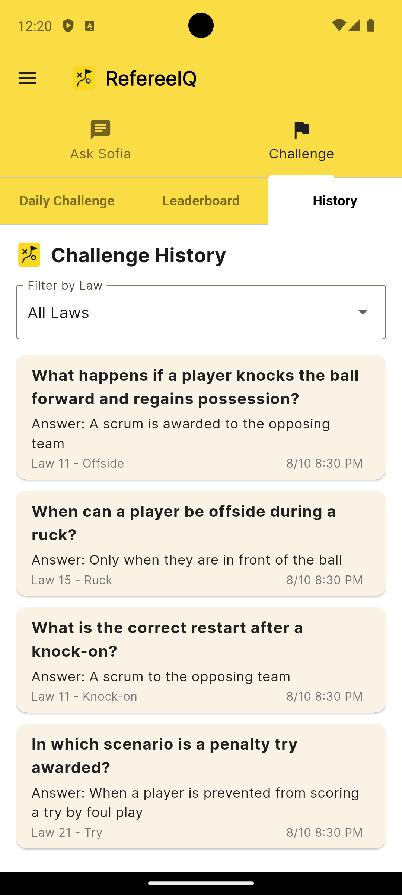

# RefereeIQ — Rugby laws, explained in seconds

From quick calls to in-depth scenarios, RefereeIQ helps you make sense of Rugby Union with clear, contextual answers.

Meet **Sofia**, your friendly rugby laws coach. She’s trained to understand the flow, nuance, and context of Rugby Union — so you can have real, back-and-forth conversations about even the most complex situations.

---

## How It’s Different
A rugby law book tells you the black-and-white text.  
**RefereeIQ adds the missing layer:** *context*.  
Know not just **what** the law says — but **why** a call was made, or why it wasn’t.

---

## Screenshots

  
  
  
  

---

## Get the App
[Get it on Google Play](#) *(coming soon)*

---

## Privacy Policy
[Read our Privacy Policy](./privacy.md)

---

© {{ site.time | date: '%Y' }} RefereeIQ. All rights reserved.
